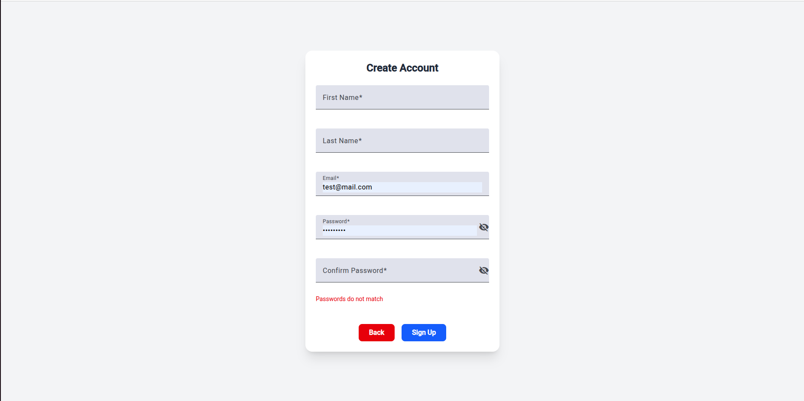

# Elite Blog – MEAN Stack Blogging Web Application

**Elite Blog** is a MEAN stack blogging platform developed as part of a technical test for a job interview.  
It allows users to create, edit, and manage blog posts with role-based permissions, real-time commenting, and notifications.

---

## 🛠 Tech Stack

- **Frontend:** Angular 19, Angular Material, Tailwind CSS
- **Backend:** Node.js 20, Express.js
- **Database:** MongoDB
- **Other Libraries & Tools:**
  - JWT Authentication (with refresh tokens)
  - Socket.IO (real-time notifications)
  - SweetAlert2
  - Infinite Scroll (lazy loading posts)
  - Rate Limiting (DDos protection)

---

## Backend Repo

* https://github.com/akramBNA/elite_blog_backend

---

## Development Approach

This project was developed under a restricted timeframe, following the principle:

> **Make it work → Make it fast → Make it pretty**

Due to time constraints, some planned features (like NgRx store for state management and improved UI/UX) were not fully implemented.

---

## Installation & Setup

* npm install
* npm start
* Also set up URL for the Backend and the socket.

---

## User Roles & Permissions

### There are 4 roles in the application:

* Admin:

- Full access to all features

- Can change roles of other users

- Can create, edit, and delete posts

* Editor

- Can edit all posts

- Can create new posts

* Writer: Can create and edit only their own posts

* Reader: Can read and comment on posts but cannot create posts

---

## Actions:

* Change User Roles: Only Admins can change the roles of other users

* Post Management: Create Post: Admins, Editors, and Writers can create posts with a title, content, tags, and optional image URL

* Edit Post: Admins and Editors can edit any post; Writers can only edit their own

* Delete Post: Only Admins can delete posts

* Comments & Replies: All users can comment on and reply to any post

* Readers cannot create posts but can still comment and reply

## Important Notes:

* First sign-up should be done from the backend to grant an Admin role.

* All new users who sign up through the UI start as Writers until the Admin changes their role.

* All users (except Readers) can create posts and comment on others’ posts.

* All users can reply to comments.

---

## Notifications

* Real-time notifications via Socket.IO

* Users receive a notification when someone comments or replies to their post

* Readers receive notifications only for replies to their comments (since they cannot create posts)

---

## Other features:

* Infinite scroll: post are loaded by a batch of 5 posts, another batach will load when reaching the buttom of the page.

* Protecting routes with auth guard & interceptors.

* Loading spinner & alerts are used from a shared component.

* Using a role based permissions: some feature like users list and delete, edit posts are only visible to some roles..

## Future Improvements

* Enhance UI/UX for a smoother experience

* Add post image upload (instead of only URL input)

* Implement pagination for comments

* CRUD operations on users

* Add charts for site stats

---

## ScreenShots:

### Home Page

### Create Account

### Alert Popup

### Comment Notification

### Create Account Monile View

### Create Post Mobile View

### Drop Down Menu Mobile View

### Home Page Mobile View

### Main Feed and Menu

### Posts Feed Mobile View

### Reply Notification

### Reply with Comments

### Update Role 1

### Update Role

### Users List

### Users List Mobile View

### Users Search

